<h1 align='center'>🚀 Agentic-AIGC: Multi-Modal Agents for Video Production</h1>

<div align='center'>
    <h3>
    One Prompt to Final Cut: AI-Powered Video Creation Unleashed<br/>
    一句话，一键成片：AI助你实现创意自由
    </h3>
    <a href='https://space.bilibili.com/3546868449544308'></a>&nbsp;
    <a href='https://www.youtube.com/@AI-Creator-is-here'></a>&nbsp;
    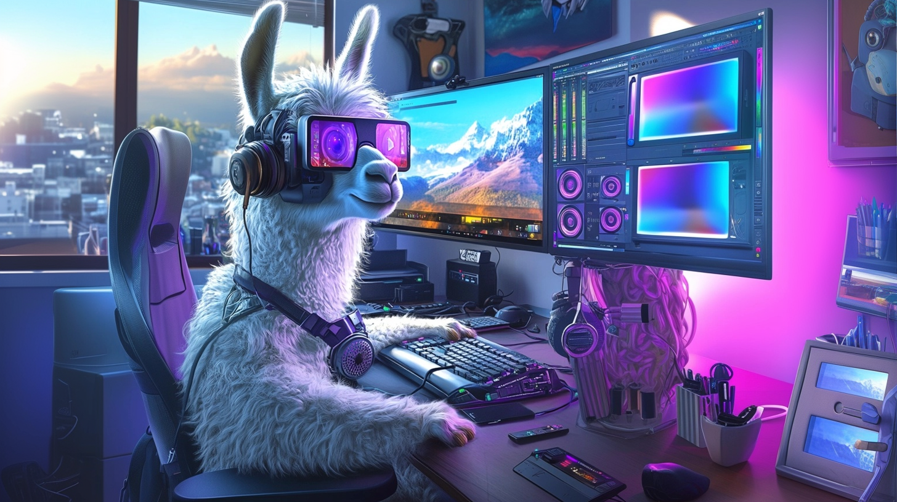
</div>

# 🎉 News
- [x] [2025.05] 🎯 Plan to update code framework!
- [x] [2025.04.24] 📢 Achieve more precise visual perception during storyboarding and editing to capture specific characters frames and understand source video.
- [x] [2025.04.14] 📢 Update the usage and codes of Agentic-AIGC!
- [x] [2025.04.08] 📢 Our demo videos have received over 100k views and 19k likes! Watch them on <a href='https://space.bilibili.com/3546868449544308'>bilibili</a> !
- [x] [2025.04.07] 📢 Releasing three more interesting demo videos made by Agentic-AIGC on our bilibili account!
- [x] [2025.04.07] 📢 Releasing the video retrieval implementation code of Agentic-AIGC! Supporting all the demo video types showcased!
- [x] [2025.03.31] 📢 Releasing the audio files of Agentic-AIGC (Meme Videos, AI Music Videos, English Talk Show to Chinese Crosstalk Conversion)!
- [x] [2025.03.31] 📢 Releasing the audio implementation code of Agentic-AIGC!
- [x] [2025.03.31] 📢 Releasing the first demo videos! Including Movie Edits, Meme Videos, AI Music Videos, English Talk Show to Chinese Crosstalk Conversion, AI-Generated TV Drama Clips, and Tech News Updates

# Usage
[中文文档](https://o86nig8lht.feishu.cn/docx/P86mdzslVowcz7xuGJ0cE7n0n2b?from=from_copylink)

## Environment
```
GPU Memory：8GB
System: Linux、Windows
```

## Clone and Install
```
git clone https://github.com/HKUDS/Agentic-AIGC.git
conda create --name aicreator python=3.10
conda activate aicreator
conda install -y -c conda-forge pynini==2.1.5 ffmpeg
pip install -r requirements.txt
```
## Model Download
```
# Make sure git-lfs is installed (https://git-lfs.com)
git lfs install
```
```
# Download CosyVoice
cd tools/CosyVoice
huggingface-cli download PillowTa1k/CosyVoice --local-dir pretrained_models
```
```
# Download fish-speech
cd tools/fish-speech
huggingface-cli download fishaudio/fish-speech-1.5 --local-dir checkpoints/fish-speech-1.5
```
```
# Download seed-vc
cd tools/seed-vc
huggingface-cli download PillowTa1k/seed-vc --local-dir checkpoints
```
```
# Download DiffSinger
cd tools/DiffSinger
huggingface-cli download PillowTa1k/DiffSinger --local-dir checkpoints
```
```
# Download MiniCPM
cd tools
git lfs clone https://huggingface.co/openbmb/MiniCPM-V-2_6-int4
```
```
# Download Whisper
cd tools
git lfs clone https://huggingface.co/openai/whisper-large-v3-turbo
```
```
# Download all-MiniLM-L6-v2
cd tools
git lfs clone https://huggingface.co/sentence-transformers/all-MiniLM-L6-v2
```
```
# Download ImageBind
cd tools
mkdir .checkpoints
cd .checkpoints
wget https://dl.fbaipublicfiles.com/imagebind/imagebind_huge.pth
```
```
🌟Multiple models are available for your convenience; you may wish to download only those relevant to your project.
```
<div align="center">

<table>
  <tr>
    <th align="center">Feature Type</th>
    <th align="center">Video Demo</th>
    <th align="center">Required Models</th>
  </tr>
  <tr>
    <td align="center">Cross Talk</td>
    <td align="center">English Stand-up Comedy to Chinese Crosstalk</td>
    <td align="center">CosyVoice, MiniCPM, Whisper, ImageBind, all-MiniLM-L6-v2 </td>
  </tr>
  <tr>
    <td align="center">Talk Show</td>
    <td align="center">Chinese Crosstalk to English Stand-up Comedy</td>
    <td align="center">CosyVoice, MiniCPM, Whisper, ImageBind, all-MiniLM-L6-v2</td>
  </tr>
  <tr>
    <td align="center">MAD TTS</td>
    <td align="center">Xiao-Ming-Jian-Mo(小明剑魔) Meme</td>
    <td align="center">fish-speech</td>
  </tr>
  <tr>
    <td align="center">MAD SVC</td>
    <td align="center">AI Music Videos</td>
    <td align="center">DiffSinger, seed-vc, MiniCPM, Whisper, ImageBind, all-MiniLM-L6-v2</td>
  </tr>
  <tr>
    <td align="center">Rhythm</td>
    <td align="center">Spider-Man: Across the Spider-Verse</td>
    <td align="center">MiniCPM, Whisper, ImageBind, all-MiniLM-L6-v2</td>
  </tr>
  <tr>
    <td align="center">Comm</td>
    <td align="center">Novel-to-Screen Adaptation</td>  
    <td align="center">MiniCPM, Whisper, ImageBind, all-MiniLM-L6-v2</td>
  </tr>
  <tr>
    <td align="center">News</td>
    <td align="center">Tech News: OpenAI's GPT-4o Image Generation Release</td>
    <td align="center">MiniCPM, Whisper, ImageBind, all-MiniLM-L6-v2</td>
  </tr>
</table>

</div>

## LLM Config
```
# Agentic-AIGC\environment\config\config.yml 
# Input your LLM API
llm:
  api_key:
  base_url: 
```
Model names may vary depending on the LLM base URL.
The correct model names must be specified in `environment/config/llm.py`.
For direct APIs that support only a single model (e.g., the official GPT series), all model names should be replaced with the corresponding supported model (e.g., `gpt-4o-mini`)
## Input Config
```
# Configure the input of cross talk videos in advance (rhythm_agent/news_agent/comm_agent/cross_talk/mad_svc/mad_tts).yml files
# eg. Agentic-AIGC\environment\config\cross_talk.yml
cross_talk:
  reqs: 'Generate a Chinese crosstalk (Xiangsheng) script. The story should be based on objectively existing situations, set against a Chinese background, avoiding examples from other countries. The script should be approximately 40-50 sentences long.'
  audio_path: 'dataset/cross_talk/英文脱口秀1.wav'
  dou_gen: 'dataset/cross_talk/郭德纲'
  peng_gen: 'dataset/cross_talk/付航'
  output: "dataset/user_output_video/cross_talk_video.mp4"
  video_source_dir: "dataset/user_video/"
```
## Character Image for Visual Retrieval Enhancement
```
Under the dataset\video_edit\face_db, add images of the character to be recognized to enhance visual retrieval
The completed character images folders structure should look like this, notice that the name of the character folder must be the same as the character name (eg. Spiderman/Batman/Superman...):

face_db
├── Spiderman ── image01.png
└── Batman ── image02.png

```
## Command Line Usage
```
# With the configuration now complete, proceed to run the following instructions:
python main.py
# The console will output:
Please describe the type of video you would like to produce:
# You can choose Cross Talk、Talk Show、TTS、SVC、Rhythm-Based Editing、Summary of Comment Types、Summary of News
```

# 🎥 Demos & How We Made Them

**Note**: All videos are used for research and demonstration purposes only. The audio and visual assets are sourced from the Internet. Please contact us if you believe any content infringes upon your intellectual property rights.

## 1. 🎬 Agentic Video Editing
Ever dreamed of creating stunning video edits that captivate your audience? With Agentic-AIGC, you can transform your favorite video clips into breathtaking montages that tell your unique story, complete with perfectly synchronized music and transitions.

In **video production and editing**, finding visual information is crucial, as it allows for better alignment with music, audio, or text. Agentic-AIGC extracts useful visual information from videos, and here we use VideoRAG to index and caption videos of unlimited length. You can configure your settings in `videoragcontent.py`

```
class VideoRAG:
    working_dir: str = field(
        default_factory=lambda: f"./videorag_cache_{datetime.now().strftime('%Y-%m-%d-%H:%M:%S')}"
    )
    
    # video
    threads_for_split: int = 10
    video_segment_length: int = 30 # 30 seconds
    rough_num_frames_per_segment: int = 10 # 5 frames
```
Creating videos with Agentic-AIGC requires aligning with the user's ideas, which is a key step. First, the user inputs a query about their video idea, and Agentic-AIGC performs a more granular query decomposition of the user's idea. This results in several sub-queries, each of which can match a video clip in the material library, enabling video creation. When using the Movie Editing feature, the storyboard agent `story_editor.py` percept the available visual material, allowing for more precise generation and utilization of each sub-query.

In the final stage of video production, the duration of each shot may vary. The video editor agent `vid_editor.py` performs fine-grained visual editing based on each retrieved video segment by comparing the video content with the corresponding sub-queries. It selects the moments that best match the visual content with the lowest redundancy for use.


### 1.1 Agentic Movie Edits

🚀 **Technical Details**
- Users just need to prepare the video sources, music audio file and the idea they want.
- Automatically extract music rhythm points (optional) setting threshold & mask parameters.
- Automatically assists with storyboard query design through video content based on user-provided ideas.
- Automatically complete the editing and integration of the video.

In beat-synced video editing, cuts and transitions align with the music's rhythm. We also enhance the narrative through visual storytelling by featuring high-energy visuals during musical climaxes.
In the beat synchronization module, we load .mp3 audio files using librosa and calculate RMS (Root Mean Square) energy to identify rhythmic patterns. The system finds rhythm points by detecting peaks in the energy signal above a configurable threshold, with options to filter out points that are too close together temporally (since viewers may not prefer excessive transitions at the beginning of a video). The video transition times and spectrogram with detected rhythm points are sent to `story_editor.py`, enabling the agent to determine which transitions require high-energy frames.
You can configure your preferences in`music_filter.py`:
```
    # Define mask ranges - times in seconds where you don't want to detect rhythm points
    mask_ranges = [(0, 5)]
    
    # Detect rhythm points
    rhythm_data = agent.detect_rhythm_points(
        energy_threshold=0.4,
        min_interval=3.0,
        smoothing_window=5,
        mask_ranges=mask_ranges
    )
```


#### 1.1.1 *Spider-Man: Across the Spider-Verse*
<a href='https://www.bilibili.com/video/BV1C9Z6Y3ESo/' target='_blank'>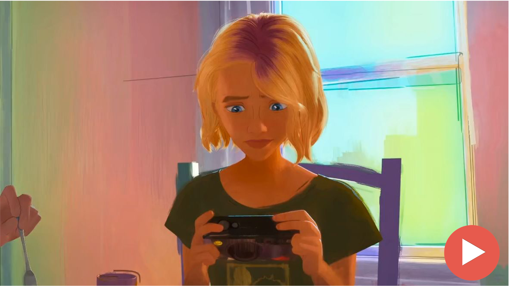</a>

🌟 **Key Features:**
- Perfect sync between visuals and background music rhythm (eg. 13s, 22s, 25s)
- Expert capture of high-energy scenes (<1 min) from the full movie (>2 hours)
- Maintain visual continuity and reduce redundant clips
- Accurately align the storyboard description of the user prompt (eg. 1st, 2nd sections)

Through intelligent analysis of hours of film footage, Agentic-AIGC automatically identifies **rhythm cues**, **high-energy action scenes**, and **character highlights** to achieve precise editing.

📝 **Prompt**:
```
Begin with Gwen with blonde hair sitting at a dining table in front of a window, followed by her playing drums with pop textures and notes in the background. Include action scenes featuring Miguel O'Hara in his dark blue suit with red accents, sharp red claws and black/red eye lenses, Spider-Gwen in her white and pink suit with hood and ballet shoes, Miles Morales with curly hair and red spider logo on his chest, and The Spot in his black suit covered in white spots using portal powers. Focus on the chase scene in the blue sky with trains, and emphasize quality motion such as web-swinging, fighting, and colorful special effects throughout the sequence.
```

#### 1.1.2 *Interstella*

<a href='https://www.bilibili.com/video/BV1yQZ6YkEkw/' target='_blank'>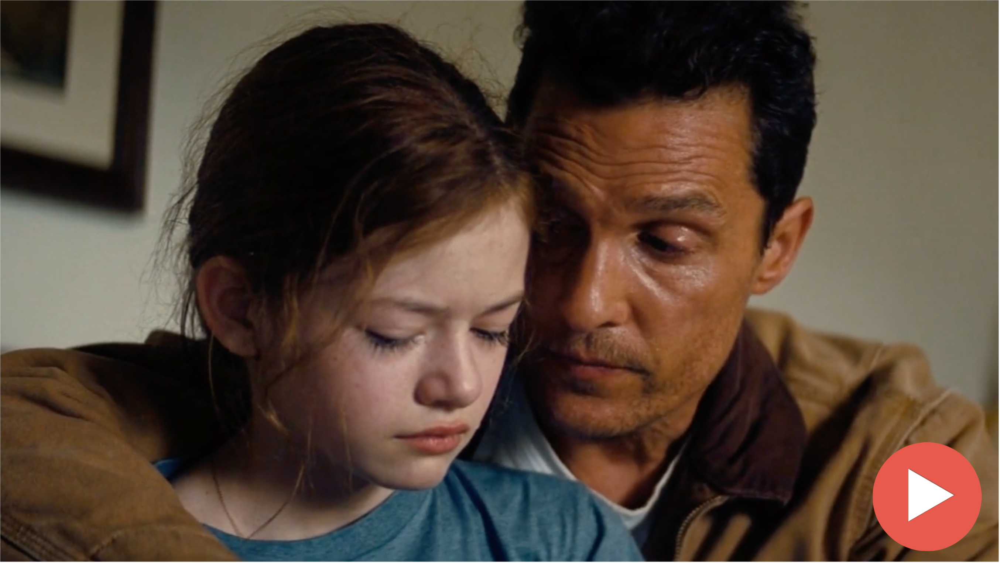</a>&nbsp;&nbsp;&nbsp;&nbsp;&nbsp;&nbsp;&nbsp;
<a href='https://www.bilibili.com/video/BV1koZ6YuEeL/' target='_blank'>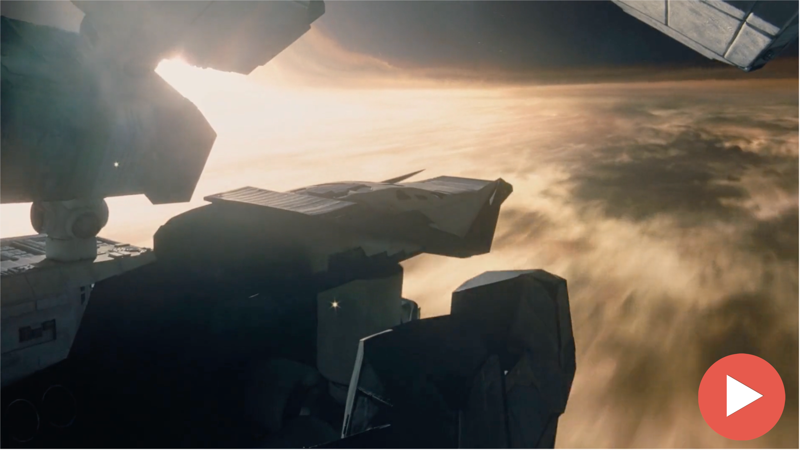</a>

🌟 **Key Features:**
- For the same input video, edit different styles by adapting your prompts

We showcase two distinct edits of *Interstella* created using Agentic-AIGC. The first version focuses on the theme "love transcending space and time," while the second emphasizes humanity's courage in space exploration. Both edits demonstrate how different prompts can shape the narrative and emotional impact of the same source material.

📝 **Prompt**:
```
Version 1:
Love can transcend time and space.
```
```
Version 2:
Celebrate humanity's courage in space exploration. Include scenes featuring spaceships, wormholes, black holes, space station docking maneuvers, ocean planets, and glacial worlds. Show astronauts in their distinctive white spacesuits as they venture into the unknown, highlighting mankind's relentless drive to explore the cosmos.
```

#### 1.1.3 *Nezha*
<a href='https://www.bilibili.com/video/BV1NQZ6YCEPH/' target='_blank'>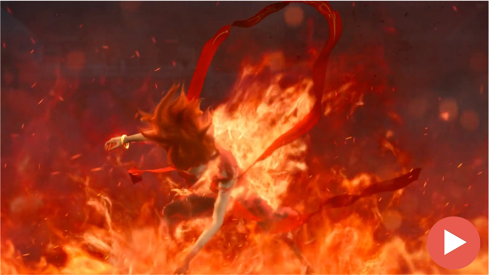</a>

🌟 **Key Features:**
- Capturing scences of conflicts and battles

📝 **Prompt:**
```
Capture more scenes of conflicts and battles between Nezha and Shen Gongbao (black-robed), Dragon Prince Ao Bing (blue-robed).
```

#### 1.1.4 *Titanic*
<a href='https://www.bilibili.com/video/BV12mZ6YLEXJ/' target='_blank'>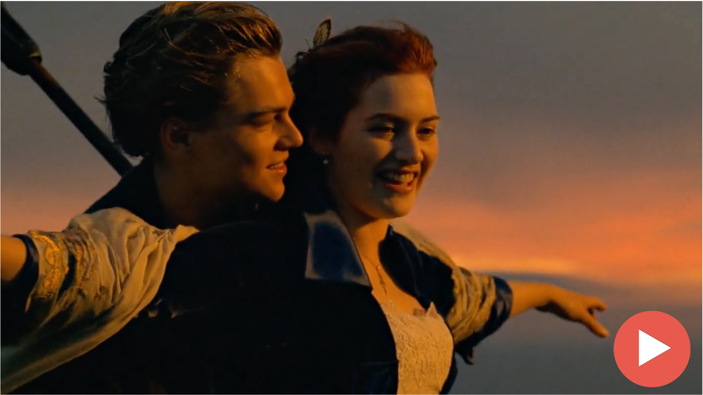</a>

🌟 **Key Features:**
- Understanding of romantic scenes

📝 **Prompt:**
```
A romantic and sweet love story about Jack and Rose meeting on the Titanic. It cannot include the part where the ship is in distress, nor the night scene. In the first section, Rose, wearing a purple hat and a white shirt, walks out of a white car with a purple umbrella, looking thoughtfully.
```

### 1.2 Agentic Novel-to-Screen Edits
Want to bring your favorite novels to life? Agentic-AIGC transforms written narratives into compelling video adaptations, complete with AI-generated scenes, characters, and dialogues - all without the need for actual filming or actors. Experience your beloved stories in a whole new medium.

🚀 **Technical Details**

- Users just need to provide their idea, novel/book txt file and film/tv series video source files they want as visual materials.
- (Optional) Provide favorite commentary audio files for cloning.
- (Optional) Customized presentation style txt file.
- Automatically write copy based on the provided novel/book text content.
- Automatically complete video material splicing and audio integration.

🌟 **Key Features:**
- Transforming novel narratives into visual storytelling by adapting descriptive text into cinematic scenes
- Automated scene matching that pairs textual descriptions with appropriate visual elements, ensuring narrative coherence
- Audio generation

<a href="https://www.bilibili.com/video/BV1TmZ6YjEvV/" target='_blank'>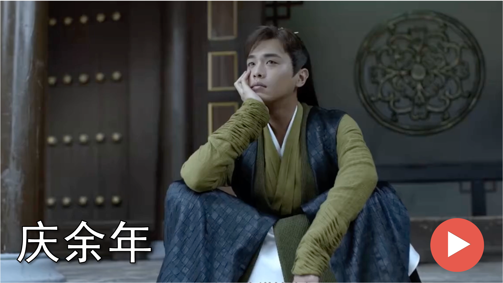</a>

We used Agentic-AIGC to generate a video adaptation of the opening chapters from *Joy of Life*. Our agents analyzed the novel's text and automatically created a compelling video sequence by intelligently selecting and arranging relevant scenes from the TV series.

📝 **Prompt:**
```
Write fluent commentary script with 1500 words.
```

### 1.3 Agentic News Summary Edits
Want to create engaging tech news videos? Agentic-AIGC helps transform complex technical updates into visually appealing content with dynamic graphics and clear explanations that keep viewers informed and engaged.

🚀 **Technical Details**

- Users only need to provide their idea and the interview/news source files they want to summarize.
- (Optional) Provide favorite audio files for cloning.
- (Optional) Customize presentation style txt file.
- Automatically transcribe the interview content through voice and extract key information of people/events to write news summaries.
- Automatically complete video material splicing and audio integration.

#### 1.3.1 Tech News: OpenAI's GPT-4o Image Generation Release
<table>
<tr>
<td align="center" width="50%">
<a href="https://www.bilibili.com/video/BV12mZ6YLEqW/" target='_blank'>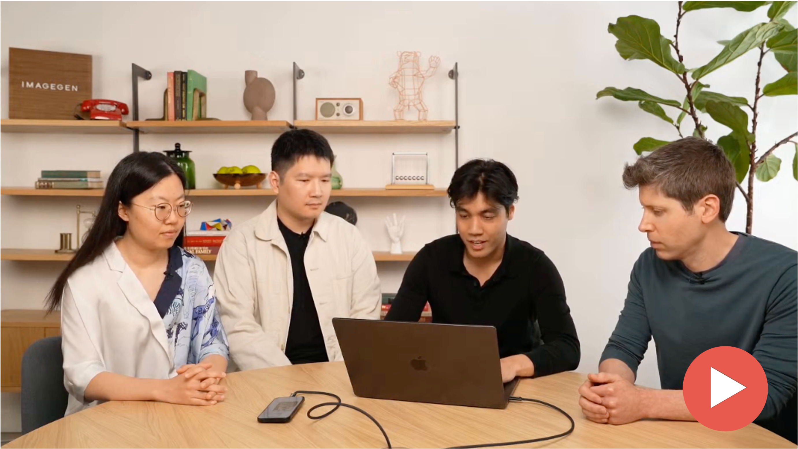</a>
Tech News made by Agentic-AIGC
</td>
<td align="center" width="50%">
<a href="https://www.youtube.com/watch?v=2f3K43FHRKo" target='_blank'></a>
Original Tech Report
</td>
</tr>
</table>

🌟 **Key Features:**
- Automated news content summarization
- Accurate audio and video clip alignment (eg. 1:00 Generate a comic about relativity, 1:09 Generate a trade card image including the dog Sanji)
- Audio generation

📝 **Prompt:**
```
Short tech news, colloquial expression within 250 words, check the accuracy of key terms, e.g. the GPT model name should be 4o instead of 4.0
```

#### 1.3.2 Dune 2 Movie Cast Update Interview
<table>
<tr>
<td align="center" width="50%">
<a href="https://www.bilibili.com/video/BV1m1Z6Y2Erb/" target='_blank'>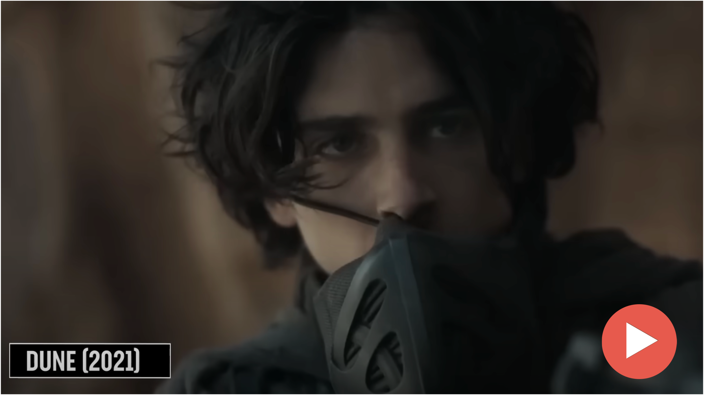</a>
Podcast Summarization About <i>Dune</i> 2 Cast
</td>
<td align="center" width="50%">
<a href="https://www.youtube.com/watch?v=AVQRnDFZ1Qs" target='_blank'></a>
Original Podcast with <i>Dune</i> 2 Cast
</td>
</tr>
</table>

🌟 **Key Features:**
- Automated news content summarization
- Accurate audio and main characters video clip alignment (eg. 00:13 Timothée Chalamet, 00:28 Zendaya, 00:38 Romance, 00:47 Florence Pugh, 00:56 Austin Butler, 01:06 Javier Bardem)
- Audio generation

📝 **Prompt:**
```
Short movie podcast, colloquial expression within 300 words, notice to identify which actor or host is talking, don't mention movie tickets available issue.
```

## 2. Agentic Video Remaking
Want to create engaging and hilarious meme videos? Agentic-AIGC helps you craft memorable content by intelligently combining video clips, text, and effects into shareable content that could go viral.

### 2.1 🎨 Agentic Meme Video

🚀 **Technical Details**
- Users just need to provide the video path and your requirements.
- Automatically preprocesses audio (voice separation, loudness normalization, resampling, transcription) with corresponding agents
- Automatically segments the audio and performs segment-level copywriting adaptation via the Writer Agent
- Uses the Infer Agent for zero-shot inference on audio segments
- Aligns and merges audio-visual content automatically with the Combiner Agent

🌟 **Key Features:**
- Intelligent understanding and transformation of meme concepts
- Precise audio synthesis and precise scene matching

#### 2.1.1 Master Ma as AI Researcher
<table>
<tr>
<td align="center" width="50%">
<a href='https://www.bilibili.com/video/BV1ucZ6YmEBU/' target='_blank'>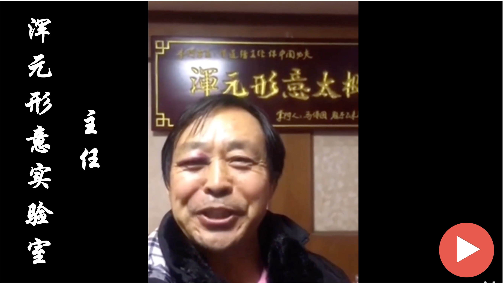</a>
Master Ma as AI Researcher
</td>
<td align="center" width="50%">
<a href='https://www.bilibili.com/video/BV1584y1N7cR/' target='_blank'>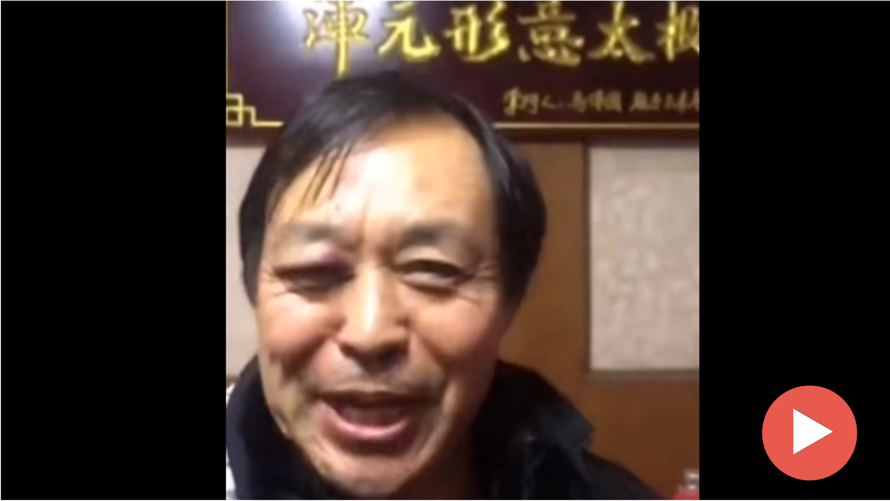</a>
Original Video of Master Ma
</td>
</tr>
</table>


📝 **Prompt:**
```
Create a humorous narrative about two PhD students seeking advice from Master Ma. For the two PhD students, one of them is known for high citation counts and the other for numerous publications. Transform martial arts terms into AI research terminology while keeping phrase lengths similar (length difference should be less than two Chinese characters). The story highlights their academic rivalry and ends with Master Ma advising against "窝里斗" (internal competition). Keep signature phrases like "大意了没有闪" (wasn't cautious enough) and "四两拨千斤" (achieving great results with minimal effort) while avoiding mentions of real institutions. The word combinations should be logical and appropriate for an academic context.
```

#### 2.1.2 Xiao-Ming-Jian-Mo(小明剑魔) Meme
<table>
<tr>
<td align="center" width="50%">
<a href='https://www.bilibili.com/video/BV1gFZ6YEE5W' target='_blank'>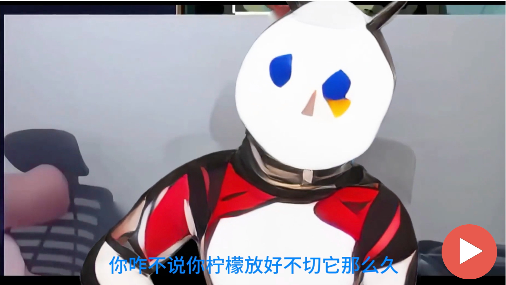</a>
Video 1: Mixue's Response
</td>
<td align="center" width="50%">
<a href='https://www.bilibili.com/video/BV1ucZ6YmE5x'></a>
Video 2: Find Your Own Problems
</td>
</tr>
<tr>
<td align="center" width="50%">
<a href='https://www.bilibili.com/video/BV1ucZ6YmEFQ' target='_blank'></a>
Video 3: MVP
</td>
<td align="center" width="50%">
<a href='https://www.bilibili.com/video/BV1ZYQzY5E1x' target='_blank'>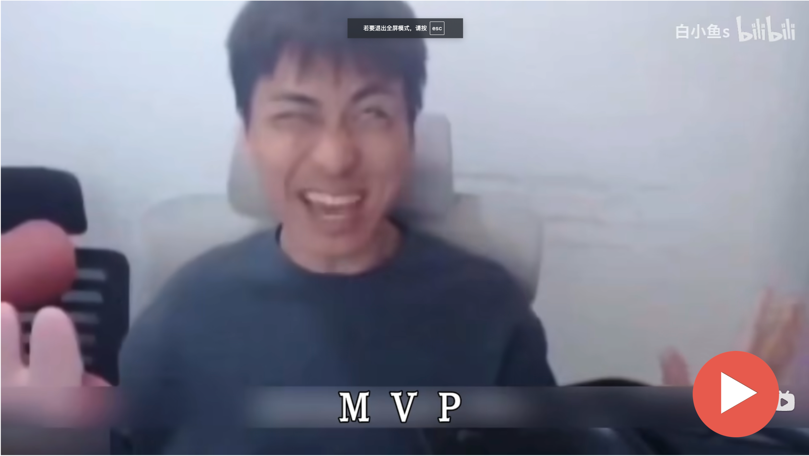</a>
Video 4: Original 小明剑魔 Video
</td>
</tr>
</table>

The 小明剑魔 meme has gained massive popularity recently through his insightful yet comedic streaming commentary. Many content creators have successfully adapted his distinctive speech pattern into creative videos. We've used Agentic-AIGC to generate three videos of this viral meme format, each capturing the unique style and energy of the original while adding new creative elements.

📝 **Prompts**:
```
Video 1:
Background: Mixue Ice Cream is a national chain brand focusing on ice cream and tea beverages. On March 15th (Consumer Rights Day), they were reported to be using overnight lemons. However, compared to other exposures, using overnight lemons isn't considered a particularly serious violation and is somewhat understandable.

- Speaker: Snow King (Mixue's representative)
- Purpose: Emphasize that the **overnight lemon** situation isn't too serious, highlighting Mixue's good reputation
- Must preserve the phrases "Look in my eyes tell me why why baby why", "回答我"
- Must end with the word "说话"
- If the original text contains awkward phrasing, such as redundant words or confused semantics, don't imitate that style or sentence structure
- Ensure natural and fluent sentences
```
```
Video 2:
Based on the following scenario, create an angry rebuttal from Zhuge Liang (me):
- Speaker: Zhuge Liang (me)
- Start with "**北伐失败怎么不找找自己问题**" (Why don't you look at your own problems for the failure of the Northern Expedition), followed by "...找自己问题" pattern sentences that **all** reference anime events
- Anime examples must mention specific characters
- Only the **last** "...找自己问题" should return to the Northern Expedition scenario
- Use colloquial language and diverse anime references
```
```
Video 3:
Based on the following scenario, create an angry rebuttal from Zhuge Liang (me):
- Speaker: Zhuge Liang (me)
- Zhuge Liang (me) is challenged about why a certain Three Kingdoms character has a higher rating than him and launches a fierce rebuttal
- Must include: "三点零、十三点零、躺赢狗"
- Do not start with "零杠几"
- Later rating comparisons should show stark differences (can be exaggerated)
- Use colloquial language, align with historical facts, and only replace specific content
```

### 2.2 Agentic Music Videos
Ready to create music videos realizing your creative ideas? Agentic-AIGC helps you write lyrics, select singers you specify, and generate matching visuals to bring your musical vision to life. The system can coordinate lyrics, visuals, and music to create engaging amateur music videos.

🚀 **Technical Details**
- Users just need to provide the music MIDI file, original lyrics, BGM file (optional), target voice file, and requirements. 
- Automatically performs loudness normalization and annotates the MIDI file using the Annotator Agent.
- Automatically calibrates and adapts lyrics at the word level via the Analyzer Agent.
- Automatically divides long rest intervals to reduce melodic errors and enables song covers.


<a href='https://www.bilibili.com/video/BV1t8ZCYsEeA/' target='_blank'>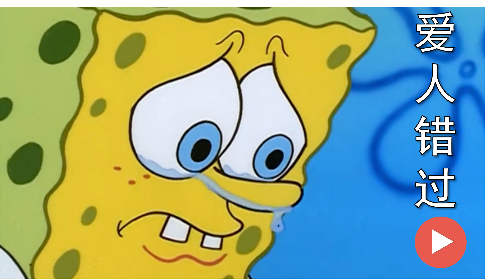</a>

🌟 **Key Features:**
- Automated lyric generation based on themes
- Intelligent matching of visuals and lyrics

📝 **Prompts**:
```
The song is performed by Patrick Star, focusing on the theme of ​**"the struggles of manuscript submission and dealing with overly critical reviewers"**, following the original lyrics' sentence structure while replacing specific content. It incorporates elements of reviewer nitpicking (e.g., questioning innovation, demanding redundant experiments) and expresses frustration with lines like "If only I could swap reviewers, this academic fate is too cruel" to highlight the emotional toll of peer review.
```

### 2.3 Agentic Cross-Culture Comedy
Interested in bridging cultural gaps through comedy? Transform popular English talk show segments into authentic Chinese crosstalk performances, and vice versa. Complete with cultural adaptations and localized humor that resonates with audiences of different culture backgrounds.

🚀 **Technical Details**
- Users just need to provide the target cross-talk (comedy dialogue) audio file.
- Automatically adapts the script based on the provided target audio file.
- Automatically selects the appropriate vocal tone for voice cloning according to the emotional context of the script.

🌟 **Key Features:**
- Cultural context adaptation and localization of humor
- Performance style transformation while preserving core comedic elements
- Voice generation

#### 2.3.1 English Stand-up Comedy to Chinese Crosstalk
<table>
<tr>
<td align="center" width="50%">
<a href="https://www.bilibili.com/video/BV1ucZ6YmESg/" target='_blank'>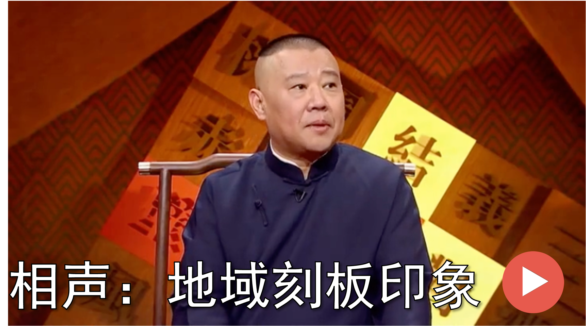</a>
Chinese Crosstalk Adaptation
</td>
<td align="center" width="50%">
<a href="https://www.bilibili.com/video/BV1u1421t78T" target='_blank'></a>
Original Stand-up Comedy Segment
</td>
</tr>
</table>

#### 2.3.2 Chinese Crosstalk to English Stand-up Comedy
<table>
<tr>
<td align="center" width="50%">
<a href="https://www.bilibili.com/video/BV13oZzYnEZq/" target='_blank'></a>
Stand-up Comedy Adaptation
</td>
<td align="center" width="50%">
<a href="https://www.bilibili.com/audio/au4765690/" target='_blank'>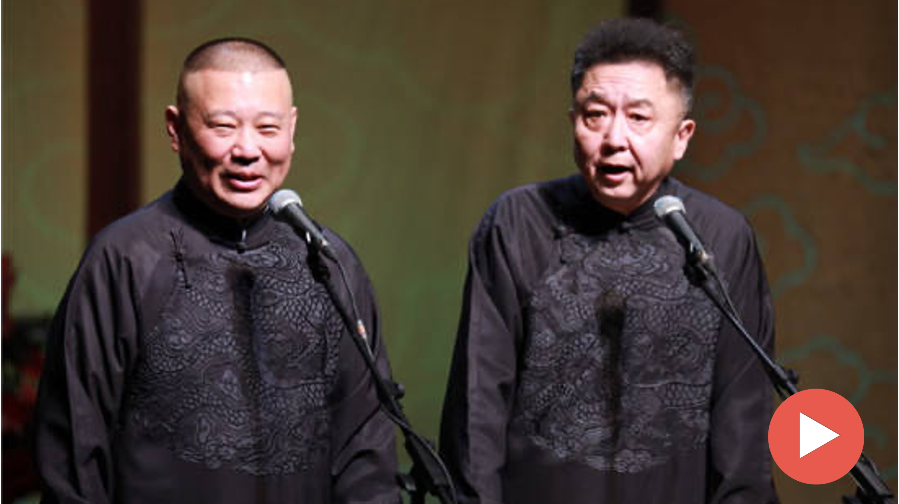</a>
Original Chinese Crosstalk Segment
</td>
</tr>
</table>

## 3. Agentic Video Generation
Want to generate original, multi-modal video content from scratch?​​ Agentic-AIGC empowers you to create compelling videos by intelligently synthesizing visuals, music, and narratives into cohesive productions that bring your ideas to life.

🚀 **Technical Details**
- Users just need to provide video description and requirements. 
- Automatically generates detailed shot descriptions
- Automatically maintains character and scene consistency
- Automatically assembles final videos by orchestrating editing tools

🌟 **Key Features:**
- Restore the novel's plot in Ghibli style  
- Maintain consistency in characters and scenes  
- Automatic addition of subtitles

<a href='https://www.bilibili.com/video/BV1NYhAzjEWn' target='_blank'></a>

# Acknowledgements

We would like to express our deepest gratitude to the numerous individuals and organizations that have made Agentic-AIGC possible. This project stands on the shoulders of giants, benefiting from the collective wisdom of the open-source community and the groundbreaking work of AI researchers worldwide.

First and foremost, we are indebted to the open-source community and AI service providers whose tools and technologies form the foundation of our work:

- [CosyVoice](https://github.com/FunAudioLLM/CosyVoice)
- [Fish Speech](https://github.com/fishaudio/fish-speech)
- [Seed-VC](https://github.com/Plachtaa/seed-vc)
- [DiffSinger](https://github.com/MoonInTheRiver/DiffSinger)
- [VideoRAG](https://github.com/HKUDS/VideoRAG)
- [ImageBind](https://github.com/facebookresearch/ImageBind)
- [whisper](https://github.com/openai/whisper)
- [MiniCPM](https://github.com/OpenBMB/MiniCPM-o)
- [Librosa](https://github.com/librosa/librosa)
- [moviepy](https://github.com/Zulko/moviepy)
- [ffmpeg](https://github.com/FFmpeg/FFmpeg)

Our work has been significantly enriched by the creative contributions of content creators across various platforms:
- The talented creators behind the original video content we used for testing and demonstration
- The comedy artists whose work inspired our cross-cultural adaptations
- The filmmakers and production teams behind the movies and TV shows featured in our demos
- The content creators who have shared their knowledge and insights about video editing techniques

All content used in our demonstrations is for research purposes only. We deeply respect the intellectual property rights of all content creators and welcome any concerns or feedback regarding content usage.
- Spider-Man movie editing idea reference Douyin account[@我是不是zx](https://www.douyin.com/user/MS4wLjABAAAApVuuGxyM7CI4MJRHQvc6SAy0J2zrJ12eg3f5jFqCIXk?from_tab_name=main&vid=7468621366913273115)

<!-- # Framework of Agentic-AIGC

[First a framework plot]
Then a short explanation on the framework, without specific technical details. -->

